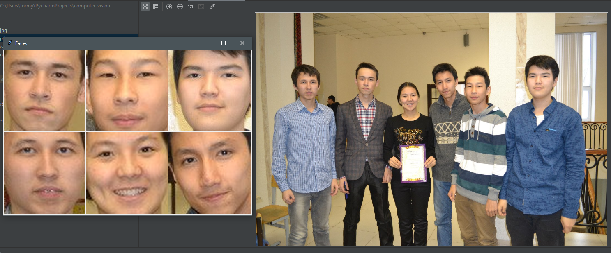
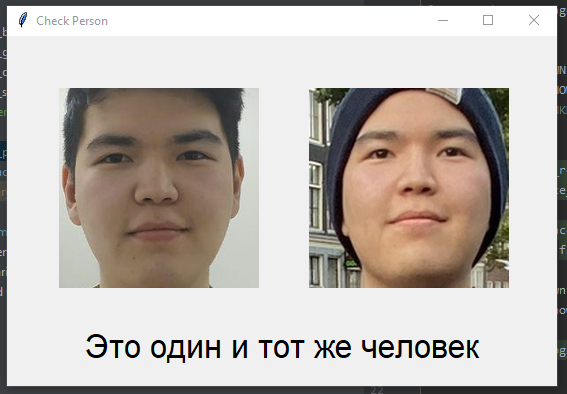
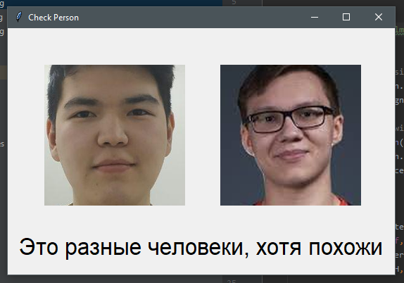

# Face recognition module

Project for testing functionality of Face Recognition python module

## Prerequisites

Python version >3.5 - [download](https://www.python.org/downloads/)

## Installation

```
pip install -r requirements.txt
```

## Usage

* Load your own images into folder `images`
* To find all faces inside photo:
    * Go to the folder `scripts`
    * Open `find_faces.py`
    * Change `IMAGE_LOCATION` configuration variable value to the location of photo 
    you want to **check** (Preferably photo with **multiple people**)
    * Run `python find_faces.py`
* To check if two faces are the same person
    * Go to the folder `scripts`
    * Open `check_person.py`
    * Change `IMAGE_LOCATION_KNOWN` configuration variable value to the location of photo of person 
    you want to **check**. (Must be photo with only **one person**)
    * Change `IMAGE_LOCATION_UNKNOWN` configuration variable value to the location of photo of person 
    you want to **compare with the first one**. (Must be photo with only **one person**)
    * Run `python check_person.py` 
    
## Demo

#### Finding faces


#### Same person


#### Different person


## Built With

* [Face recognition](https://github.com/ageitgey/face_recognition) - Python module for Face recognition